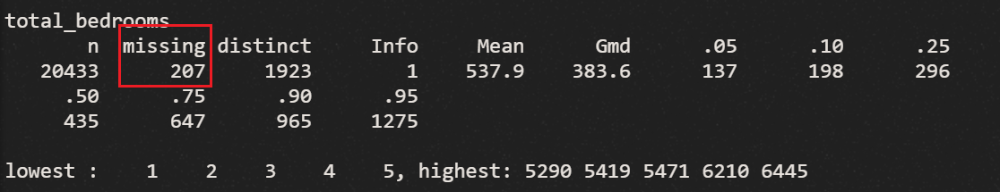

# California Housing Data (1990) on Kaggle

### Group 6
* 郭育丞(Morton Kuo) 107363015 
* 劉書傳 108971017 

### Goal
Predict the housing price of California in 1990.

### Demo 
You should provide an example commend to reproduce your result
``` text
Rscript code/1072_datascience_FP_G6.R
```
* any on-line visualization

## Folder organization and its related information

### docs
* Your presentation, 1072_datascience_FP_<yourID|groupName>.ppt/pptx/pdf, by **Jun. 25**
* Any related document for the final project
  * papers
  * software user guide

### data

* Source
  * [California Housing Data (1990) of Kaggle](https://www.kaggle.com/harrywang/housing)
* Input format
  * One file formatted with `.csv`
  * Features of dataset:
    * longitude: A measure of how far west a house is
    * latitude: A measure of how far north a house is
    * housing_median_age: Median age of a house within a block
    * total_rooms: Total number of rooms within a block
    * total_bedrooms: Total number of bedrooms within a block
    * population: Total number of people residing within a block
    * households: Total number of households, a group of people residing within a home unit, for a block
    * median_income: Median income for households within a block of houses (measured in 10,000$)
    * ocean_proximity: Location of the house
    * median_house_value: Median house value for households within a block (measured in US Dollars)
  
* Any preprocessing?
  * Handle missing data
    * total_bedrooms has 207 missing value.
      
  * Scale value
    * population_per_household
    * bedrooms_per_room 
    * rooms_per_household
    
  
### code

* Which method do you use?
  * Linear regression / Lasso / Ridge / Elastic net 
  * SVM / RF / GBT / Stacking
* What is a null model for comparison?
  * Linear regression with no regressor.
* How do your perform evaluation? ie. Cross-validation, or extra separated data
  * k-fold

### results

* Which metric do you use ?
  * MAPE
* Is your improvement significant?
  * Yes ! We improve MAPE from 1.84 to 1.76
* What is the challenge part of your project?
  * Tuning

## Reference
* Code/implementation which you include/reference (__You should indicate in your presentation if you use code for others. Otherwise, cheating will result in 0 score for final project.__)
* Packages you use
  * mice, ggplot2, dplyr, gapminder, scales, hrbrthemes, viridis, ggcorrplot, rBayesianOptimization, randomForest, rpart, tidyverse, caret, pROC, regclass, adabag, alr4, DMwR, nnet,  
* Related publications
  *  https://jmyao17.github.io/Kaggle/California_Housing_Prices.html
  *  https://rpubs.com/ablythe/520912
  *  [In a random forest, is larger %IncMSE better or worse? (2016).](https://bit.ly/2BeuUAR
  *  Lander, J. P. (2017). R for Everyone: Advanced Analytics and Graphics, 2nd Edition.
  *  Ozdemir, S., Susarla, D. (2018). Feature Engineering Made Easy.
  *  Ariga, M., Nakayama, S., Nishibayashi, T. (2018). Machine Learning at Work


